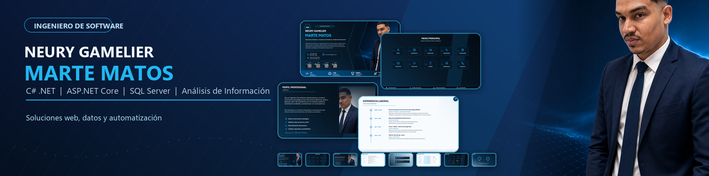

  

  <h1>Neury Gamelier Marte Matos</h1>
  
<strong>Ingeniero de Software | C# .NET | ASP.NET Core | SQL Server | Análisis de Información</strong>

  
  

---

### Perfil profesional

Soy ingeniero de software con experiencia en desarrollo de aplicaciones web, escritorio y móviles, administración de bases de datos, análisis de información y automatización de procesos. Me enfoco en construir soluciones eficientes, escalables y orientadas al impacto real, con atención al detalle, aprendizaje continuo y capacidad para trabajar en entornos dinámicos.

Actualmente desarrollo soluciones tecnológicas para análisis de información, integración de datos, visualización estratégica, automatización de reportes e indicadores, con énfasis en calidad, seguridad, escalabilidad y buenas prácticas de desarrollo.

### Tecnologías y herramientas

  
  
  
  
  
  
  
  
  
  
  
  
  
  

### En qué trabajo

- Desarrollo de sistemas web, escritorio y móviles con enfoque en productividad, seguridad y escalabilidad.
- Diseño de arquitectura de software, modelado de datos y administración de bases de datos.
- Automatización de procesos, reportes e indicadores para mejorar la toma de decisiones.
- Integración, análisis y visualización de información estratégica.
- Construcción de interfaces orientadas a usuarios reales, flujos operativos y resultados medibles.

### Experiencia

| Período | Organización | Rol |
| --- | --- | --- |
| 2020 - Actual | Empresa de análisis y procesamiento de informaciones (Propia) | Ingeniero de Software - Análisis de Información |
| 2019 - 2020 | Ejército de República Dominicana | Analista de Sistemas |
| 2017 - 2019 | Claro / Opitel | Técnico en Sistemas |
| 2016 - 2017 | Wilmer Tec/Comp | Técnico en Informática |

### Proyectos destacados

**SAIP - Sistema de Análisis de Informaciones Panda**  
Plataforma avanzada para gestión, análisis y visualización de información estratégica, con integración de mapas, reportes y procesos de apoyo a decisiones.

**PANDA MARS**  
Plataforma multiplataforma orientada a análisis, gestión, generación de reportes y visualización de información en tiempo real.

**Aplicaciones Web Empresariales**  
Desarrollo de soluciones con ASP.NET Core, SQL Server y arquitecturas escalables, orientadas a eficiencia operativa y mantenimiento sostenible.

> Algunos proyectos son institucionales o privados por razones de seguridad, confidencialidad y propiedad operativa.

### Fortalezas profesionales

- Pensamiento analítico y estratégico.
- Orientación a resultados y mejora continua.
- Aprendizaje acelerado y adaptación a nuevas tecnologías.
- Responsabilidad, ética profesional y atención al detalle.
- Trabajo en equipo con enfoque multidisciplinario.

### Formación

- Ingeniería de Software, UNICARIBE.
- Inglés por inmersión, MESCyT.
- Español nativo e inglés avanzado B2.

### Contacto

- LinkedIn: [neury-gamelier-marte-matos](https://www.linkedin.com/in/neury-gamelier-marte-matos/)
- Email: [neurimarte@gmail.com](mailto:neurimarte@gmail.com)
- GitHub: [@PandaMarte12](https://github.com/PandaMarte12)
